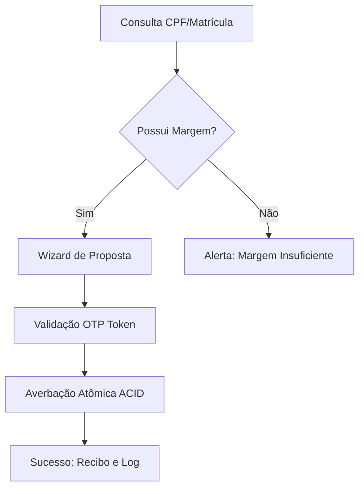
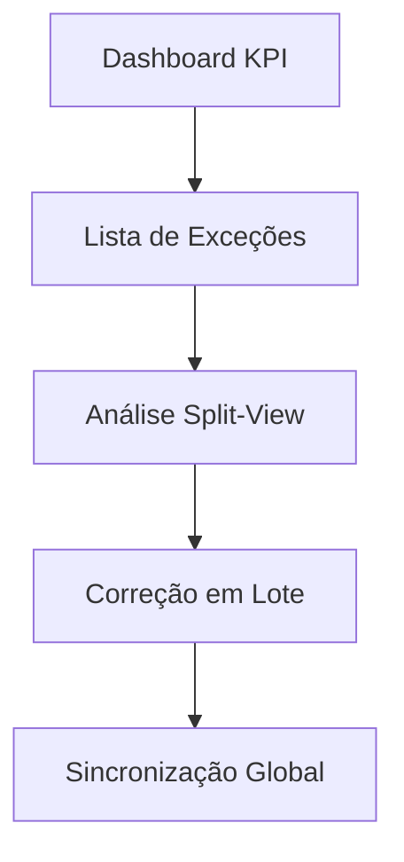

# UX Design Specification Fast Consig

**Author:** Eudres
**Date:** 2026-01-11

---

## 1. Executive Summary

### Project Vision
Uma plataforma SaaS Fintech moderna projetada para substituir sistemas legados. A visão é transformar operações complexas e manuais de crédito consignado em uma experiência digital fluida e de alto desempenho. A inovação da "Margem Viva" garante atualizações reativas em milissegundos, eliminando "quedas de reserva" e construindo confiança absoluta entre órgãos, bancos e servidores.

### Target Users
*   **Gestor de RH (Consignante):** Focado em agilidade e precisão. Precisa resolver divergências de folha em minutos e gerenciar milhares de funcionários via ferramentas de processamento em lote.
*   **Operador Bancário:** Necessita de confiabilidade e velocidade. Realiza consultas "blind" e averbações de alto volume, exigindo um fluxo seguro e intuitivo baseado em wizards.
*   **Agente/Correspondente:** Precisa de visibilidade. Acompanha propostas em tempo real e demanda comunicação transparente sobre mudanças de status.
*   **Super Admin:** Orquestrador técnico. Gerencia tenants, regras de negócio e a saúde global da plataforma.

### Key Design Challenges
*   **Gestão de Densidade de Dados:** Equilibrar dados financeiros ricos com interfaces limpas e acessíveis que evitem sobrecarga cognitiva.
*   **Comunicação de Operações Assíncronas:** Manter os usuários informados e confiantes durante importações bulk (até 10k linhas) com feedback claro de "sucesso parcial".
*   **Segurança Sem Fricção:** Implementar fluxos complexos de MFA e autorização via Token como parte natural da jornada, e não como uma interrupção.

### Design Opportunities
*   **Reconciliação Visual de Divergências:** Usar pistas visuais de alto contraste e dashboards inteligentes para tornar a conferência manual obsoleta.
*   **UI Impulsionada por Confiança:** Fornecer evidências digitais instantâneas (recibos, logs imutáveis) no momento da transação para reforçar a credibilidade do sistema.
*   **Inteligência Proativa (Push):** Transicionar o usuário de um modo reativo de "busca por erros" para um fluxo proativo de "resolução de anomalias detectadas".

---

## 2. Core User Experience

### 2.1 Defining Experience: A Averbação Atômica
A experiência core do Fast Consig é a **Averbação Atômica em Tempo Real**. O sistema elimina a incerteza operacional ao garantir que o momento da validação do token seja o exato momento da reserva da "Margem Viva" e da geração da evidência jurídica. É o fluxo que transforma uma operação bancária complexa em um gesto de confiança instantâneo.

### 2.2 User Mental Model
O usuário migra de um modelo de "espera e conferência" para um modelo de **"reserva e fluxo"**. O Operador Bancário enxerga a margem como um recurso finito que ele precisa "bloquear" com segurança, enquanto o Gestor de RH opera sob um modelo de **Gestão por Exceção**, confiando que o sistema automatiza o fluxo normal e só solicita sua atenção para divergências críticas.

### 2.3 Success Criteria
*   **Instantaneidade Visual:** Consulta de margem com latência imperceptível (<200ms).
*   **Integridade Visível:** Feedback visual de que a transação foi "selada" e é imutável.
*   **Reatividade Ubíqua:** Atualização de saldos e status em toda a plataforma sem necessidade de refresh manual.

### 2.4 Novel UX Patterns
*   **Feed de Auditoria Narrativo:** Substituição de logs técnicos por uma linha do tempo em linguagem natural para rastreabilidade emocional.
*   **Calculadora de Margem Preditiva:** Visualização em tempo real do impacto de uma proposta antes mesmo da efetivação.
*   **Status de Transação Atômica:** Um indicador de progresso que mapeia os micro-estados da transação ACID (Lock -> Validate -> Reserve -> Receipt).

### 2.5 Experience Mechanics
1.  **Gatilho:** Consulta "Blind" bem-sucedida (CPF+Matrícula).
2.  **Ação de Valor:** Preenchimento da proposta com feedback visual imediato sobre a margem restante.
3.  **Momento de Verdade:** Validação atômica do Token 2FA (Redis getDel) com transição de interface para estado de "Efetivado".
4.  **Fechamento:** Entrega imediata do recibo digital e atualização global do estado do servidor.

---

## 3. Desired Emotional Response

### 3.1 Primary Emotional Goals
*   **Confiança Absoluta:** Eliminar a incerteza do sistema legado. O usuário deve sentir que o sistema é uma "rocha" matemática e jurídica.
*   **Empoderamento e Controle:** O Gestor de RH deve sentir que domina a complexidade da folha, agindo como um estrategista e não como um digitador de erros.
*   **Alívio Produtivo:** O sistema deve atuar para "tirar pesos" das costas do usuário, transformando tarefas de horas em segundos de satisfação.

### 3.2 Emotional Journey Mapping
*   **Descoberta e Acesso:** Sensação de segurança profissional através de uma autenticação moderna e robusta (Clerk).
*   **Durante a Tarefa (Averbação/Conciliação):** Estado de "Flow". Interface silenciosa que permite foco total e velocidade sem ansiedade.
*   **Conclusão de Transação:** Orgulho e segurança. O recebimento da evidência digital atua como o selo de encerramento emocional da tarefa.
*   **Cenários de Recuperação:** Apoio e calma. Erros são apresentados como "caminhos de correção", mantendo o usuário no controle da situação.

### 3.3 Micro-Emotions
*   **Confirmação (Trust):** Pequenos sinais visuais (micro-interações) que confirmam o sucesso de operações atômicas críticas.
*   **Progressão (Momentum):** Acompanhamento visual fluido de tarefas pesadas (upload de 10k linhas) que gera satisfação pela produtividade em curso.
*   **Vigilância Amigável:** Alertas de expiração de token que protegem o usuário sem causar pânico sonoro ou visual.

### 3.4 Design Implications
*   **Breakdown de Transparência:** Mostrar as "entranhas" do cálculo de margem para converter ceticismo em confiança absoluta.
*   **Visualização de Foco:** Ocultar o que é irrelevante e destacar anomalias para gerar alívio visual.
*   **Estética de Prestígio:** Uso de design minimalista Stone para comunicar que o usuário está operando uma ferramenta de elite.

---

## 4. UX Pattern Analysis & Inspiration

### 4.1 Inspiring Products Analysis
*   **Stripe (Dashboard):** Excelência em transformar logs técnicos e financeiros em uma narrativa compreensível.
*   **Linear (Productivity):** Performance extrema e foco em eficiência (teclado/atalhos).
*   **Nubank (Transparência):** Capacidade de explicar cálculos matemáticos complexos de forma visual e simples.

### 4.2 Transferable UX Patterns
*   **Transaction Event Feed:** Exibição narrativa do rastro de auditoria.
*   **Keyboard-First Filtering:** Agilidade na resolução de divergências em massa.
*   **Mathematical Transparency:** Popovers explicativos para decomposição de cálculos financeiros.

### 4.3 Anti-Patterns to Avoid
*   **Tabelas "Cegas":** Listas densas sem hierarquia visual.
*   **Mensagens de Erro Crípticas:** Substituir códigos técnicos por ações de recuperação orientadas ao usuário.
*   **Desorientação por Modais:** Evitar sobreposição excessiva de camadas.

---

## 5. Design System Foundation

### 5.1 Design System Choice: shadcn/ui + Tailwind CSS 4
A fundação visual e funcional será baseada no **shadcn/ui** e estilizada com **Tailwind CSS 4**, priorizando acessibilidade normativa (WCAG 2.1 AA) e performance.

### 5.2 Color System (Preset Stone)
Paleta de cores baseada no preset **Stone** (shadcn), priorizando neutralidade e sofisticação orgânica.
*   **Primary:** Stone 900/950.
*   **Surface/Background:** Stone 50 (Redução de fadiga visual).
*   **Menu Accent:** Estilo *subtle*.

### 5.3 Typography System (Noto Sans)
Utilização da família **Noto Sans** como fonte primária, com ativação de *Tabular Figures* para alinhamento perfeito de valores numéricos em tabelas.

---

## 6. Design Direction Decision

### 6.1 Chosen Direction: Integrated Hybrid Approach
Optamos por uma interface **Contextual-Híbrida** baseada no preset Stone:
*   **Gestão e Navegação:** Baseada em Sidebar (V1) para máxima produtividade.
*   **Visão Estratégica:** Baseada em Bento Grid (V5) para dashboards de KPIs.
*   **Transação Crítica:** Baseada em Split-View e Wizard Minimalista (V3/V6) para a Averbação Atômica.

### 6.2 Implementation Approach
Construção de "Layout Shells" específicos no pacote `@fastconsig/ui`, permitindo que a interface se adapte dinamicamente ao contexto da tarefa (Management, Transaction ou Dashboard).

---

## 7. User Journey Flows

### 7.1 Averbação Atômica (Operador Bancário)
**Objetivo:** Realizar a reserva de margem e efetivar o empréstimo instantaneamente, eliminando a "queda de reserva".
*   **Trigger:** Consulta bem-sucedida (CPF/Matrícula).
*   **Flow:**
    1.  **Margem Viva:** Visualização do saldo atualizado em milissegundos com detalhamento do cálculo.
    2.  **Proposta:** Wizard minimalista focado em valores e prazos.
    3.  **Token de Confiança:** Validação via OTP (6 dígitos) com UX de alta performance.
    4.  **Efetivação:** Transição visual para estado de "Recibo Digital" com log imutável gerado.
*   **Diagrama:**

### 7.2 Reconciliação por Exceção (Gestor de RH)
**Objetivo:** Resolver divergências de folha em massa sem análise manual de cada linha.
*   **Flow:**
    1.  **Dashboard de Anomalias:** Identificação visual imediata de divergências críticas.
    2.  **Visualização Split:** Comparação lado a lado entre Folha vs. Sistema Fast Consig.
    3.  **Ações em Lote:** Aprovação ou Rejeição massiva com feedback de progresso real.
*   **Diagrama:**

### 7.3 Journey Patterns
*   **Progressive Disclosure:** Informação financeira complexa revelada apenas sob demanda (Popovers explicativos).
*   **Atomic States:** Feedback visual de "travamento" da operação em cada micro-etapa (Locking, Validating, Reserved).

---

## 8. Component Strategy

### 8.1 Component References (Premium UI)
Baseado nos sites de referência solicitados, os componentes do `@fastconsig/ui` seguirão os seguintes padrões:

| Componente | Referência | Racional UX |
| :--- | :--- | :--- |
| **Dashboard Bento Grid** | [Magic UI](https://magicui.design) | Visualização estratégica de KPIs (Margem Viva, Volume, Ocupação). |
| **Layout Shell / Sidebar** | [shadcn/ui Pro Blocks](https://shadcndesign.com/pro-blocks) | Sidebar colapsável inteligente para navegação em multi-contexto. |
| **OTP Input** | [Origin UI](https://originui.com) | Campo de 6 dígitos com UX superior (auto-focus, paste, keyboard-friendly). |
| **Data Tables (High Density)** | [Skiper UI](https://skiper-ui.com) | Gestão de milhares de funcionários com performance de 60fps e filtros avançados. |
| **Auth Forms** | [Shadcn Studio](https://shadcnstudio.com) | Fluxos de login/signup com foco em segurança sem fricção. |
| **Calendars & Pickers** | [Kibo UI](https://kibo-ui.com) | Seleção de datas financeiras e cronogramas de parcelas complexos. |

### 8.2 Custom Components Design
*   **MargemTracker:** Um indicador visual animado (via [Aceternity](https://pro.aceternity.com)) que pulsa conforme a atualização da "Margem Viva".
*   **AuditNarrative:** Um componente de feed que traduz logs JSON para linguagem natural (ex: "Operador X reservou R$ 500,00 para CPF Y").

### 8.3 Implementation Roadmap
*   **Phase 1 (Core):** Auth/OTP, Layout Shell, Base Typography (Stone Preset).
*   **Phase 2 (Data):** High-density Tables, Filters, Split-view Panels.
*   **Phase 3 (Insight):** Bento Dashboards, Animated Trackers, Audit Feeds.

---

## 9. UX Consistency Patterns

### Button Hierarchy & Actions
*   **Ação Crítica:** Botão sólido Stone 950 com transição suave. Representa o encerramento de um fluxo financeiro.
*   **Ação de Suporte:** Estilo *Ghost* ou *Outline* (Stone 200) para evitar ruído visual em tabelas densas e dashboards.
*   **Ação Destrutiva:** Vermelho (Red 600) com confirmação via modal minimalista de dois fatores.

### Feedback Patterns
*   **Transações ACID:** Toasts persistentes por 3s para sucessos; persistentes até ação humana para erros críticos ou avisos de margem.
*   **Margem Viva:** Atualização visual via "Pulse Effect" (Stone 400) no valor quando alterado via WebSocket, garantindo percepção de tempo real.
*   **Explicação Matemática:** Popovers informativos que revelam a decomposição de cálculos ao pairar (Hover) sobre valores de margem e parcelas.

### Form & Validation Patterns
*   **Focus State:** Ring Stone 400 para destacar o campo ativo de forma elegante.
*   **Validação em Tempo Real:** Mensagens de erro em linguagem natural abaixo do input (ex: "CPF inválido ou não encontrado na base do consignante").
*   **Auto-focus OTP:** O fluxo de averbação direciona o foco automaticamente para o campo de 6 dígitos após a validação da proposta.

### Loading & Empty States
*   **Skeleton Screens:** Mimetização da estrutura de tabelas e grids para reduzir a ansiedade do usuário durante o carregamento de grandes volumes de dados.
*   **Empty State Actionable:** Telas vazias que sugerem a próxima ação lógica (ex: "Nenhuma averbação encontrada. Clique aqui para iniciar uma nova").

---

## 10. Responsive Design & Accessibility

### Responsive Strategy
*   **Desktop-First for Density:** Layouts otimizados para grandes monitores, priorizando a visibilidade de dados financeiros e ferramentas de reconciliação.
*   **Mobile-Actionable:** Versão mobile focada em fluxos de aprovação rápida, consulta de CPF/Margem e notificações críticas de sistema.
*   **Touch Optimization:** Aumento de alvos de toque (mínimo 44x44px) em dispositivos móveis e tablets para evitar erros em operações financeiras.

### Breakpoint Strategy
*   **Mobile (sm/md):** 320px - 767px. Transição de tabelas para listas de cards simplificados e uso de *Bottom Sheets* para ações.
*   **Tablet (lg):** 768px - 1023px. Sidebar colapsável automaticamente e tabelas com scroll horizontal suave.
*   **Desktop (xl/2xl):** 1024px+. Layout multi-coluna, sidebar persistente e uso máximo de densidade de dados.

### Accessibility Strategy (WCAG 2.1 AA)
*   **Contrast & Color:** Padrão Stone com contraste verificado (4.5:1). Uso de ícones e textos para reforçar estados de erro, não dependendo apenas de cor.
*   **Keyboard First:** Navegação completa via teclado. Implementação de *Skip Links* e gerenciamento de foco rigoroso em modais e Wizards.
*   **Screen Readers:** Marcação ARIA completa (`aria-live`, `aria-label`, `roles`) para garantir que operadores com deficiência visual possam processar averbações com segurança.

### Testing Strategy
*   **Automated Audits:** Uso de ferramentas como Axe-core integradas ao CI/CD para evitar regressões de acessibilidade.
*   **Device Lab:** Validação em dispositivos reais (iOS/Android) para garantir a performance das animações e interações de segurança.
