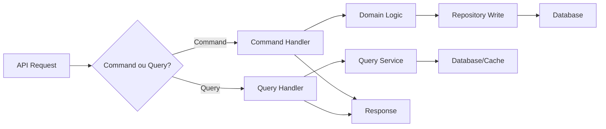

# Arquitetura Tecnica - FastConsig

**Versao:** 1.0
**Data:** Janeiro 2026
**Status:** Draft

---

## 1. Visao Geral da Arquitetura

### 1.1 Diagrama de Contexto (C4 Level 1)

```
+---------------------------------------------------+
|                   USUARIOS                        |
+---------------------------------------------------+
|  Consignante  |  Consignataria  |     Agente      |
|   (Orgao)     |    (Banco)      | (Correspondente)|
+-------+---------------+------------------+--------+
        |               |                  |
        v               v                  v
+---------------------------------------------------+
|              FASTCONSIG SYSTEM                    |
|                                                   |
|  +---------------------------------------------+  |
|  |            Web Application (SPA)            |  |
|  +---------------------------------------------+  |
|                       |                           |
|  +---------------------------------------------+  |
|  |              API Gateway                    |  |
|  +---------------------------------------------+  |
|                       |                           |
|  +---------------------------------------------+  |
|  |           Backend Services (API)            |  |
|  +---------------------------------------------+  |
|        |              |              |            |
|  +----------+  +------------+  +-----------+      |
|  | Database |  |   Cache    |  |  Storage  |      |
|  +----------+  +------------+  +-----------+      |
+---------------------------------------------------+
        |               |              |
        v               v              v
+---------------------------------------------------+
|              SISTEMAS EXTERNOS                    |
+---------------------------------------------------+
|  SMTP Server  |  Folha Pagamento  |  Webhooks     |
+---------------------------------------------------+
```

### 1.2 Principios Arquiteturais

| Principio | Descricao |
|-----------|-----------|
| **Clean Architecture** | Separacao clara de responsabilidades em camadas |
| **API-First** | APIs como contrato principal entre frontend e backend |
| **Multi-Tenancy** | Isolamento de dados por tenant_id |
| **Cloud-Native** | Preparado para containerizacao e orquestracao |
| **Security by Design** | Seguranca incorporada desde o inicio |
| **Scalability** | Arquitetura preparada para escala horizontal |
| **Observability** | Logs, metricas e traces integrados |

---

## 2. Stack Tecnologica Recomendada (2026)

### 2.1 Backend

| Camada | Tecnologia | Justificativa |
|--------|------------|---------------|
| **Runtime** | .NET 8+ ou Node.js 22+ | LTS, performance, ecossistema maduro |
| **Framework API** | ASP.NET Core Minimal APIs ou Fastify | Performance, tipagem |
| **ORM** | Entity Framework Core 8+ ou Prisma | Produtividade, migrations |
| **Validacao** | FluentValidation ou Zod | Validacoes expressivas |
| **Autenticacao** | JWT + ASP.NET Identity ou Passport.js | Padrao industria |
| **Background Jobs** | Hangfire ou BullMQ | Processamento assincrono |

### 2.2 Frontend

| Camada | Tecnologia | Justificativa |
|--------|------------|---------------|
| **Framework** | React 19+ ou Vue 4+ | Componentizacao, ecossistema |
| **Linguagem** | TypeScript 5.5+ | Tipagem estatica obrigatoria |
| **State Management** | Zustand ou Pinia | Simplicidade, performance |
| **Data Fetching** | TanStack Query | Cache, sincronizacao |
| **UI Components** | shadcn/ui ou Radix | Acessibilidade, customizacao |
| **Estilos** | Tailwind CSS 4+ | Utility-first, produtividade |
| **Formularios** | React Hook Form ou VeeValidate | Performance, validacao |
| **Tabelas** | TanStack Table | Flexibilidade, features |
| **Graficos** | Recharts ou Chart.js | Dashboards |

### 2.3 Banco de Dados

| Componente | Tecnologia | Justificativa |
|------------|------------|---------------|
| **Principal** | PostgreSQL 18 | Robusto, features, JSON support |
| **Cache** | Redis 7+ | Performance, pub/sub, sessions |
| **Busca** | Elasticsearch 8+ (opcional) | Full-text search avancado |

### 2.4 Infraestrutura

| Componente | Tecnologia | Justificativa |
|------------|------------|---------------|
| **Containers** | Docker | Padrao industria |
| **Orquestracao** | Kubernetes | Escala, resiliencia |
| **CI/CD** | GitHub Actions ou GitLab CI | Integracao nativa |
| **IaC** | Terraform | Cloud-agnostic |
| **Secrets** | HashiCorp Vault ou AWS Secrets | Seguranca |
| **CDN** | CloudFlare ou AWS CloudFront | Performance global |

### 2.5 Observabilidade

| Componente | Tecnologia | Justificativa |
|------------|------------|---------------|
| **Logs** | Serilog/Winston + ELK Stack | Centralizacao |
| **Metricas** | Prometheus + Grafana | Monitoramento |
| **Traces** | OpenTelemetry + Jaeger | Distributed tracing |
| **APM** | Datadog ou New Relic | Visibilidade end-to-end |

---

## 3. Arquitetura de Backend

### 3.1 Clean Architecture

```
+-----------------------------------------------------------+
|                      Presentation                         |
|  (Controllers, Middlewares, Filters, API Endpoints)       |
+-----------------------------------------------------------+
                            |
                            v
+-----------------------------------------------------------+
|                      Application                          |
|  (Use Cases, Commands, Queries, DTOs, Validators)         |
+-----------------------------------------------------------+
                            |
                            v
+-----------------------------------------------------------+
|                        Domain                             |
|  (Entities, Value Objects, Domain Services, Interfaces)   |
+-----------------------------------------------------------+
                            |
                            v
+-----------------------------------------------------------+
|                     Infrastructure                        |
|  (Repositories, External Services, Database, Email, etc)  |
+-----------------------------------------------------------+
```

### 3.2 Estrutura de Pastas (Backend .NET)

```
src/
├── FastConsig.API/
│   ├── Controllers/
│   ├── Middlewares/
│   ├── Filters/
│   └── Program.cs
│
├── FastConsig.Application/
│   ├── Commands/
│   │   ├── Averbacoes/
│   │   │   ├── CriarAverbacaoCommand.cs
│   │   │   └── CriarAverbacaoHandler.cs
│   │   └── Funcionarios/
│   ├── Queries/
│   │   ├── Averbacoes/
│   │   └── Funcionarios/
│   ├── DTOs/
│   ├── Validators/
│   ├── Mappings/
│   └── Interfaces/
│
├── FastConsig.Domain/
│   ├── Entities/
│   │   ├── Funcionario.cs
│   │   ├── Averbacao.cs
│   │   └── ...
│   ├── ValueObjects/
│   │   ├── CPF.cs
│   │   ├── Margem.cs
│   │   └── ...
│   ├── Enums/
│   ├── Events/
│   ├── Exceptions/
│   └── Interfaces/
│       ├── IFuncionarioRepository.cs
│       └── IAverbacaoRepository.cs
│
├── FastConsig.Infrastructure/
│   ├── Data/
│   │   ├── Context/
│   │   ├── Repositories/
│   │   ├── Configurations/
│   │   └── Migrations/
│   ├── Services/
│   │   ├── EmailService.cs
│   │   ├── FileStorageService.cs
│   │   └── WebhookService.cs
│   └── External/
│
└── FastConsig.Shared/
    ├── Extensions/
    ├── Helpers/
    └── Constants/
```

### 3.3 Padrao CQRS



**Commands (Escrita):**
- CriarAverbacaoCommand
- AprovarAverbacaoCommand
- CancelarAverbacaoCommand
- AtualizarFuncionarioCommand

**Queries (Leitura):**
- ObterFuncionarioPorCpfQuery
- ListarAverbacoesPendentesQuery
- ObterDashboardConsignanteQuery

### 3.4 Middleware Pipeline

```
Request
   │
   ▼
┌─────────────────────────┐
│   Exception Handler     │
├─────────────────────────┤
│   Request Logging       │
├─────────────────────────┤
│   Rate Limiting         │
├─────────────────────────┤
│   Authentication (JWT)  │
├─────────────────────────┤
│   Tenant Resolution     │
├─────────────────────────┤
│   Authorization (RBAC)  │
├─────────────────────────┤
│   Request Validation    │
├─────────────────────────┤
│   Controller/Handler    │
└─────────────────────────┘
   │
   ▼
Response
```

---

## 4. Arquitetura de Frontend

### 4.1 Estrutura de Pastas (React)

```
src/
├── app/
│   ├── routes/
│   │   ├── auth/
│   │   ├── dashboard/
│   │   ├── funcionarios/
│   │   ├── averbacoes/
│   │   └── ...
│   ├── layouts/
│   │   ├── AuthLayout.tsx
│   │   └── MainLayout.tsx
│   └── App.tsx
│
├── components/
│   ├── ui/
│   │   ├── Button/
│   │   ├── Input/
│   │   ├── Modal/
│   │   ├── DataTable/
│   │   └── ...
│   ├── forms/
│   │   ├── FuncionarioForm/
│   │   └── AverbacaoForm/
│   └── charts/
│       ├── BarChart/
│       └── PieChart/
│
├── features/
│   ├── auth/
│   │   ├── api/
│   │   ├── hooks/
│   │   ├── store/
│   │   └── types/
│   ├── funcionarios/
│   ├── averbacoes/
│   └── ...
│
├── hooks/
│   ├── useAuth.ts
│   ├── useTenant.ts
│   └── usePermissions.ts
│
├── lib/
│   ├── api.ts
│   ├── auth.ts
│   └── utils.ts
│
├── stores/
│   ├── authStore.ts
│   └── uiStore.ts
│
├── styles/
│   └── globals.css
│
└── types/
    └── index.ts
```

### 4.2 Gerenciamento de Estado

```
┌─────────────────────────────────────────────────┐
│                  Estado Global                  │
│  (Auth, Tenant, UI, Notificacoes)               │
│                   Zustand                       │
└─────────────────────────────────────────────────┘
                        │
┌─────────────────────────────────────────────────┐
│               Estado do Servidor                │
│  (Funcionarios, Averbacoes, Relatorios)         │
│               TanStack Query                    │
└─────────────────────────────────────────────────┘
                        │
┌─────────────────────────────────────────────────┐
│                Estado Local                     │
│  (Formularios, UI temporaria)                   │
│              useState/useReducer                │
└─────────────────────────────────────────────────┘
```

### 4.3 Data Fetching Pattern

```typescript
// features/funcionarios/api/funcionarios.ts
export const funcionariosApi = {
  list: (params: ListParams) =>
    api.get<PaginatedResponse<Funcionario>>('/funcionarios', { params }),

  getById: (id: number) =>
    api.get<Funcionario>(`/funcionarios/${id}`),

  getByCpf: (cpf: string) =>
    api.get<Funcionario>(`/funcionarios/cpf/${cpf}`),

  create: (data: CreateFuncionarioDto) =>
    api.post<Funcionario>('/funcionarios', data),

  update: (id: number, data: UpdateFuncionarioDto) =>
    api.put<Funcionario>(`/funcionarios/${id}`, data),
};

// features/funcionarios/hooks/useFuncionarios.ts
export function useFuncionarios(params: ListParams) {
  return useQuery({
    queryKey: ['funcionarios', params],
    queryFn: () => funcionariosApi.list(params),
  });
}

export function useFuncionario(id: number) {
  return useQuery({
    queryKey: ['funcionarios', id],
    queryFn: () => funcionariosApi.getById(id),
  });
}

export function useCreateFuncionario() {
  const queryClient = useQueryClient();

  return useMutation({
    mutationFn: funcionariosApi.create,
    onSuccess: () => {
      queryClient.invalidateQueries({ queryKey: ['funcionarios'] });
    },
  });
}
```

---

## 5. Arquitetura de Dados

### 5.1 Multi-Tenancy

**Estrategia: Banco Unico com Tenant ID**

```sql
-- Todas as tabelas possuem tenant_id
CREATE TABLE funcionario (
    id BIGSERIAL PRIMARY KEY,
    tenant_id BIGINT NOT NULL REFERENCES tenant(id),
    cpf VARCHAR(11) NOT NULL,
    nome VARCHAR(100) NOT NULL,
    -- ...outros campos
    UNIQUE (tenant_id, cpf)
);

-- Index para queries por tenant
CREATE INDEX idx_funcionario_tenant ON funcionario(tenant_id);

-- Row Level Security (PostgreSQL)
ALTER TABLE funcionario ENABLE ROW LEVEL SECURITY;

CREATE POLICY tenant_isolation ON funcionario
    USING (tenant_id = current_setting('app.tenant_id')::BIGINT);
```

### 5.2 Estrategia de Indices

| Tipo | Exemplo | Uso |
|------|---------|-----|
| **Tenant** | `(tenant_id)` | Isolamento |
| **Busca** | `(tenant_id, cpf)` | Consultas frequentes |
| **Filtros** | `(tenant_id, situacao)` | Listagens |
| **Ordenacao** | `(tenant_id, created_at DESC)` | Mais recentes |
| **Compostos** | `(tenant_id, consignataria_id, situacao)` | Relatorios |

### 5.3 Particionamento (Futuro)

```sql
-- Particionar por tenant para grandes volumes
CREATE TABLE averbacao (
    id BIGSERIAL,
    tenant_id BIGINT NOT NULL,
    -- ...
) PARTITION BY HASH (tenant_id);

CREATE TABLE averbacao_p0 PARTITION OF averbacao
    FOR VALUES WITH (MODULUS 4, REMAINDER 0);
CREATE TABLE averbacao_p1 PARTITION OF averbacao
    FOR VALUES WITH (MODULUS 4, REMAINDER 1);
-- ...
```

### 5.4 Backup e Recovery

| Aspecto | Estrategia |
|---------|------------|
| **Backup Full** | Diario, 02:00 AM, retencao 30 dias |
| **Backup Incremental** | A cada 6 horas |
| **Point-in-Time Recovery** | WAL archiving habilitado |
| **Replicacao** | Read replicas para relatorios |
| **DR** | Cross-region replication (Enterprise) |

---

## 6. Seguranca

### 6.1 Autenticacao JWT

```
┌──────────────┐     ┌──────────────┐     ┌──────────────┐
│    Client    │────>│  API Login   │────>│   Validate   │
│              │     │              │     │  Credentials │
└──────────────┘     └──────────────┘     └──────────────┘
                                                  │
                     ┌──────────────┐             │
                     │  JWT Token   │<────────────┘
                     │  + Refresh   │
                     └──────────────┘
                            │
                            ▼
┌──────────────────────────────────────────────────────────┐
│                      JWT Payload                         │
├──────────────────────────────────────────────────────────┤
│  {                                                       │
│    "sub": "user_id",                                     │
│    "tenant_id": 123,                                     │
│    "consignataria_id": 456,  // se aplicavel             │
│    "perfil": "operador",                                 │
│    "permissions": ["FUNC_VISUALIZAR", "AVER_CRIAR"],     │
│    "exp": 1234567890,                                    │
│    "iat": 1234567800                                     │
│  }                                                       │
└──────────────────────────────────────────────────────────┘
```

**Configuracao de Tokens:**
- Access Token: 15 minutos
- Refresh Token: 7 dias
- Rotacao automatica de refresh token

### 6.2 Autorizacao RBAC

```csharp
// Middleware de autorizacao
[Authorize]
[RequirePermission("AVER_APROVAR")]
public async Task<IActionResult> AprovarAverbacao(int id)
{
    // Logica de aprovacao
}

// Service de autorizacao
public class AuthorizationService
{
    public bool HasPermission(ClaimsPrincipal user, string permission)
    {
        var permissions = user.Claims
            .Where(c => c.Type == "permissions")
            .Select(c => c.Value);

        return permissions.Contains(permission);
    }

    public bool CanAccessTenant(ClaimsPrincipal user, long tenantId)
    {
        var userTenantId = user.FindFirst("tenant_id")?.Value;
        return userTenantId == tenantId.ToString();
    }
}
```

### 6.3 OWASP Top 10 - Mitigacoes

| Vulnerabilidade | Mitigacao |
|-----------------|-----------|
| **Injection** | Parameterized queries, ORM, input validation |
| **Broken Auth** | JWT, rate limiting, strong passwords |
| **Sensitive Data** | HTTPS, encryption at rest, masking |
| **XXE** | Disable DTD processing |
| **Broken Access** | RBAC, tenant isolation, authorization checks |
| **Security Misconfig** | Hardening checklist, automated scans |
| **XSS** | Output encoding, CSP headers, sanitization |
| **Insecure Deserialization** | Type validation, signed payloads |
| **Vulnerable Components** | Dependency scanning, updates |
| **Insufficient Logging** | Audit trail, SIEM integration |

### 6.4 Headers de Seguranca

```
Strict-Transport-Security: max-age=31536000; includeSubDomains
Content-Security-Policy: default-src 'self'; script-src 'self'
X-Content-Type-Options: nosniff
X-Frame-Options: DENY
X-XSS-Protection: 1; mode=block
Referrer-Policy: strict-origin-when-cross-origin
Permissions-Policy: geolocation=(), microphone=()
```

---

## 7. Integracoes

### 7.1 APIs REST

**Versionamento:** Path-based (`/api/v1/...`)

**Padrao de Response:**

```json
{
  "success": true,
  "data": { ... },
  "meta": {
    "page": 1,
    "perPage": 20,
    "total": 150,
    "totalPages": 8
  }
}

{
  "success": false,
  "error": {
    "code": "VALIDATION_ERROR",
    "message": "Dados invalidos",
    "details": [
      { "field": "cpf", "message": "CPF invalido" }
    ]
  }
}
```

### 7.2 Webhooks

```
┌──────────────┐     ┌──────────────┐     ┌──────────────┐
│   Evento     │────>│   Queue      │────>│   Webhook    │
│  (Averbacao  │     │  (RabbitMQ)  │     │   Worker     │
│   Aprovada)  │     │              │     │              │
└──────────────┘     └──────────────┘     └──────────────┘
                                                  │
                                                  ▼
                                          ┌──────────────┐
                                          │   Retry      │
                                          │   Policy     │
                                          │  (3x, exp)   │
                                          └──────────────┘
                                                  │
                                                  ▼
                                          ┌──────────────┐
                                          │  External    │
                                          │  Endpoint    │
                                          └──────────────┘
```

**Payload do Webhook:**
```json
{
  "event": "averbacao.aprovada",
  "timestamp": "2026-01-15T10:30:00Z",
  "data": {
    "id": 12345,
    "numero_contrato": "CTR2026001234",
    "funcionario_cpf": "12345678901",
    "valor_parcela": 450.00
  },
  "signature": "sha256=abc123..."
}
```

### 7.3 Processamento de Arquivos

```
┌──────────────┐     ┌──────────────┐     ┌──────────────┐
│   Upload     │────>│   Storage    │────>│   Queue      │
│   (API)      │     │   (S3/Blob)  │     │   Job        │
└──────────────┘     └──────────────┘     └──────────────┘
                                                  │
                                                  ▼
                                          ┌──────────────┐
                                          │   Worker     │
                                          │  (Background)│
                                          └──────────────┘
                                                  │
                                                  ▼
                                          ┌──────────────┐
                                          │  Validacao   │
                                          │  + Import    │
                                          └──────────────┘
                                                  │
                                                  ▼
                                          ┌──────────────┐
                                          │  Notificacao │
                                          │  (Resultado) │
                                          └──────────────┘
```

### 7.4 Email (SMTP)

```csharp
public interface IEmailService
{
    Task SendAsync(EmailMessage message);
    Task SendTemplateAsync(string template, object data, string to);
}

public class EmailService : IEmailService
{
    private readonly SmtpClient _client;
    private readonly ITemplateEngine _templates;

    public async Task SendTemplateAsync(string template, object data, string to)
    {
        var html = await _templates.RenderAsync(template, data);
        var message = new EmailMessage
        {
            To = to,
            Subject = GetSubjectForTemplate(template),
            Body = html,
            IsHtml = true
        };
        await SendAsync(message);
    }
}
```

---

## 8. Infraestrutura

### 8.1 Containerizacao

**Dockerfile (Backend):**
```dockerfile
FROM mcr.microsoft.com/dotnet/aspnet:8.0 AS base
WORKDIR /app
EXPOSE 80

FROM mcr.microsoft.com/dotnet/sdk:8.0 AS build
WORKDIR /src
COPY ["FastConsig.API/FastConsig.API.csproj", "FastConsig.API/"]
RUN dotnet restore "FastConsig.API/FastConsig.API.csproj"
COPY . .
RUN dotnet build -c Release -o /app/build

FROM build AS publish
RUN dotnet publish -c Release -o /app/publish

FROM base AS final
WORKDIR /app
COPY --from=publish /app/publish .
ENTRYPOINT ["dotnet", "FastConsig.API.dll"]
```

**docker-compose.yml:**
```yaml

services:
  api:
    build: ./src/FastConsig.API
    ports:
      - "5000:80"
    environment:
      - ConnectionStrings__Default=Host=db;Database=fastconsig
      - Redis__Connection=redis:6379
    depends_on:
      - db
      - redis

  web:
    build: ./src/FastConsig.Web
    ports:
      - "3000:80"
    depends_on:
      - api

  db:
    image: postgres:16
    environment:
      - POSTGRES_DB=fastconsig
      - POSTGRES_PASSWORD=secret
    volumes:
      - pgdata:/var/lib/postgresql/data

  redis:
    image: redis:7-alpine
    volumes:
      - redisdata:/data

volumes:
  pgdata:
  redisdata:
```

### 8.2 Kubernetes

```yaml
# deployment.yaml
apiVersion: apps/v1
kind: Deployment
metadata:
  name: fastconsig-api
spec:
  replicas: 3
  selector:
    matchLabels:
      app: fastconsig-api
  template:
    metadata:
      labels:
        app: fastconsig-api
    spec:
      containers:
      - name: api
        image: fastconsig/api:latest
        ports:
        - containerPort: 80
        resources:
          requests:
            memory: "256Mi"
            cpu: "250m"
          limits:
            memory: "512Mi"
            cpu: "500m"
        livenessProbe:
          httpGet:
            path: /health
            port: 80
          initialDelaySeconds: 10
          periodSeconds: 10
        readinessProbe:
          httpGet:
            path: /ready
            port: 80
          initialDelaySeconds: 5
          periodSeconds: 5
```

### 8.3 CI/CD Pipeline

```yaml
# .github/workflows/main.yml
name: CI/CD

on:
  push:
    branches: [main, develop]
  pull_request:
    branches: [main]

jobs:
  build:
    runs-on: ubuntu-latest
    steps:
      - uses: actions/checkout@v4

      - name: Setup .NET
        uses: actions/setup-dotnet@v4
        with:
          dotnet-version: '8.0.x'

      - name: Restore
        run: dotnet restore

      - name: Build
        run: dotnet build --no-restore

      - name: Test
        run: dotnet test --no-build --verbosity normal

      - name: Publish
        run: dotnet publish -c Release -o ./publish

  deploy-staging:
    needs: build
    if: github.ref == 'refs/heads/develop'
    runs-on: ubuntu-latest
    steps:
      - name: Deploy to Staging
        run: |
          # Deploy to staging environment

  deploy-prod:
    needs: build
    if: github.ref == 'refs/heads/main'
    runs-on: ubuntu-latest
    environment: production
    steps:
      - name: Deploy to Production
        run: |
          # Deploy to production with approval
```

### 8.4 Ambientes

| Ambiente | Proposito | Dados |
|----------|-----------|-------|
| **Development** | Desenvolvimento local | Dados fake |
| **Staging** | Testes de integracao | Dados anonimizados |
| **Production** | Producao | Dados reais |

---

## 9. Escalabilidade e Performance

### 9.1 Caching Strategy

```
┌─────────────────────────────────────────────────────────┐
│                    Cache Layers                          │
├─────────────────────────────────────────────────────────┤
│                                                          │
│  ┌─────────────┐                                        │
│  │   Browser   │  Cache-Control, ETags                  │
│  │   Cache     │  (assets, GET responses)               │
│  └─────────────┘                                        │
│         │                                                │
│         ▼                                                │
│  ┌─────────────┐                                        │
│  │    CDN      │  Static assets, API responses          │
│  │   Cache     │  (CloudFlare)                          │
│  └─────────────┘                                        │
│         │                                                │
│         ▼                                                │
│  ┌─────────────┐                                        │
│  │   Redis     │  Session, queries frequentes,          │
│  │   Cache     │  rate limiting counters                │
│  └─────────────┘                                        │
│         │                                                │
│         ▼                                                │
│  ┌─────────────┐                                        │
│  │  Database   │  Query cache, materialized views       │
│  │   Cache     │                                        │
│  └─────────────┘                                        │
│                                                          │
└─────────────────────────────────────────────────────────┘
```

**Cache Keys:**
```
funcionario:{tenant_id}:{id}
margem:{tenant_id}:{funcionario_id}
dashboard:{tenant_id}:{date}
coeficientes:{consignataria_id}:{produto_id}
```

### 9.2 Background Jobs

```csharp
public class BackgroundJobs
{
    // Processamento de importacao
    [Queue("imports")]
    public async Task ProcessarImportacao(long importacaoId)
    {
        // Processar arquivo em chunks
    }

    // Envio de webhooks
    [Queue("webhooks")]
    [AutomaticRetry(Attempts = 3, DelaysInSeconds = new[] { 60, 300, 900 })]
    public async Task EnviarWebhook(WebhookPayload payload)
    {
        // Enviar com retry
    }

    // Relatorios agendados
    [Cron("0 6 * * *")] // 6:00 AM diariamente
    public async Task GerarRelatoriosDiarios()
    {
        // Gerar e enviar por email
    }

    // Limpeza de dados
    [Cron("0 2 * * 0")] // Domingos 2:00 AM
    public async Task LimparDadosAntigos()
    {
        // Arquivar/remover dados antigos
    }
}
```

### 9.3 Rate Limiting

```csharp
// Por IP
services.AddRateLimiter(options =>
{
    options.AddFixedWindowLimiter("api", config =>
    {
        config.Window = TimeSpan.FromMinutes(1);
        config.PermitLimit = 100;
        config.QueueLimit = 10;
    });

    // Por tenant (mais permissivo)
    options.AddSlidingWindowLimiter("tenant", config =>
    {
        config.Window = TimeSpan.FromMinutes(1);
        config.PermitLimit = 1000;
        config.SegmentsPerWindow = 4;
    });
});
```

---

## 10. ADRs (Architecture Decision Records)

### ADR-001: Multi-Tenancy com Banco Unico

**Status:** Aceito

**Contexto:** Precisamos isolar dados de multiplos clientes (consignantes).

**Decisao:** Usar banco de dados unico com coluna tenant_id em todas as tabelas, combinado com Row Level Security do PostgreSQL.

**Consequencias:**
- (+) Simplicidade operacional
- (+) Migrations unificadas
- (+) Queries cross-tenant para analytics
- (-) Risco de vazamento se RLS mal configurado
- (-) Grandes tenants podem impactar performance

---

### ADR-002: CQRS sem Event Sourcing

**Status:** Aceito

**Contexto:** Separar operacoes de leitura e escrita para melhor performance.

**Decisao:** Implementar CQRS com Commands e Queries separados, mas sem Event Sourcing completo.

**Consequencias:**
- (+) Separacao de concerns
- (+) Otimizacao de queries de leitura
- (+) Facilita caching
- (-) Duplicacao de modelos
- (-) Complexidade adicional

---

### ADR-003: JWT para Autenticacao

**Status:** Aceito

**Contexto:** Precisamos de autenticacao stateless para APIs.

**Decisao:** Usar JWT com access token de curta duracao (15min) e refresh token de longa duracao (7 dias).

**Consequencias:**
- (+) Stateless, escalavel
- (+) Contem claims do usuario
- (-) Nao revogavel imediatamente
- Mitigacao: blacklist em Redis para logout

---

### ADR-004: PostgreSQL como Banco Principal

**Status:** Aceito

**Contexto:** Escolher banco de dados relacional.

**Decisao:** PostgreSQL 16+ pela robustez, features avancadas (JSONB, RLS, particionamento) e custo.

**Consequencias:**
- (+) Open source, sem custo de licenca
- (+) Features enterprise
- (+) Excelente para multi-tenancy
- (-) Menos familiar que SQL Server para equipe .NET

---

### ADR-005: React para Frontend

**Status:** Aceito

**Contexto:** Escolher framework frontend.

**Decisao:** React 19+ com TypeScript, TanStack Query para data fetching, Zustand para state management.

**Consequencias:**
- (+) Maior ecossistema
- (+) Ampla base de desenvolvedores
- (+) Excelente tooling
- (-) Mais flexivel = mais decisoes arquiteturais

---

## 11. Historico de Revisoes

| Versao | Data | Autor | Descricao |
|--------|------|-------|-----------|
| 1.0 | Janeiro 2026 | Tech Team | Versao inicial |

---

*Este documento define a arquitetura tecnica do sistema FastConsig e deve ser mantido atualizado conforme evolucao do projeto.*
