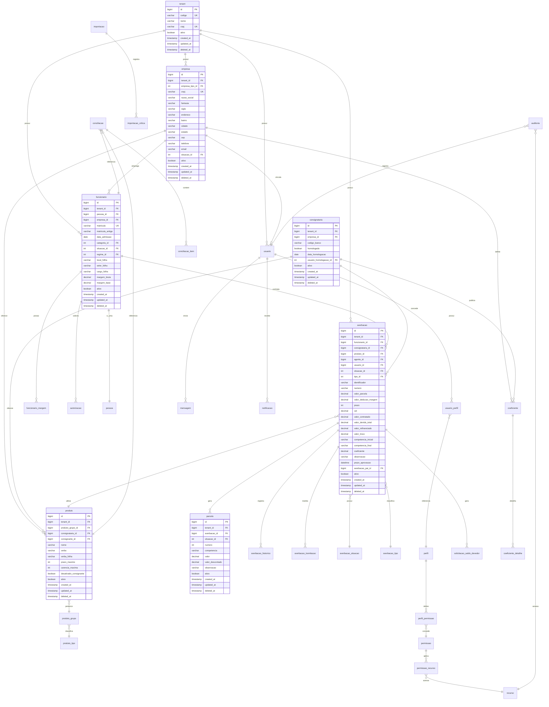

# Diagrama Entidade-Relacionamento (ER) - FastConsig

## 1. Visao Geral

O FastConsig e um sistema de gestao de emprestimos consignados brasileiro, projetado para gerenciar o ciclo completo de averbacoes (emprestimos com desconto em folha de pagamento) entre servidores publicos, orgaos consignantes e instituicoes financeiras consignatarias.

### 1.1 Principais Atores do Sistema

- **Consignante**: Orgao publico responsavel pela folha de pagamento (Prefeitura, Estado, Autarquia)
- **Consignataria**: Instituicao financeira que concede emprestimos (Banco, Financeira)
- **Funcionario**: Servidor publico que contrata emprestimos consignados
- **Agente**: Representante comercial das consignatarias

### 1.2 Conceitos de Negocio

- **Averbacao**: Registro do emprestimo consignado no sistema
- **Margem**: Valor disponivel para desconto em folha (geralmente 30-35% do salario)
- **Parcela**: Prestacao mensal do emprestimo
- **Competencia**: Mes/Ano de referencia para descontos (formato: MM/YYYY)

---

## 2. Diagrama ER - Formato Mermaid



---

## 3. Descricao Detalhada das Entidades

### 3.1 Entidades Core

#### 3.1.1 tenant (Multi-tenancy)

Tabela responsavel pelo isolamento de dados entre diferentes clientes/consignantes do sistema.

| Campo | Tipo | Tamanho | Nullable | Default | Descricao |
|-------|------|---------|----------|---------|-----------|
| id | BIGINT | - | NOT NULL | AUTO_INCREMENT | Chave primaria |
| codigo | VARCHAR | 20 | NOT NULL | - | Codigo unico do tenant |
| nome | VARCHAR | 100 | NOT NULL | - | Nome do tenant |
| cnpj | VARCHAR | 18 | NOT NULL | - | CNPJ do tenant |
| dominio | VARCHAR | 100 | NULL | - | Dominio personalizado |
| logo_url | VARCHAR | 255 | NULL | - | URL do logotipo |
| config_json | TEXT | - | NULL | - | Configuracoes em JSON |
| plano | VARCHAR | 50 | NULL | 'standard' | Plano contratado |
| ativo | BOOLEAN | - | NOT NULL | TRUE | Status ativo/inativo |
| created_at | TIMESTAMP | - | NOT NULL | CURRENT_TIMESTAMP | Data de criacao |
| updated_at | TIMESTAMP | - | NULL | - | Data de atualizacao |
| deleted_at | TIMESTAMP | - | NULL | - | Soft delete |

**Chave Primaria:** `id`
**Indices:**
- `idx_tenant_codigo` UNIQUE (codigo)
- `idx_tenant_cnpj` UNIQUE (cnpj)
- `idx_tenant_ativo` (ativo)

---

#### 3.1.2 funcionario (Servidor Publico)

Representa o servidor publico que pode contratar emprestimos consignados.

| Campo | Tipo | Tamanho | Nullable | Default | Descricao |
|-------|------|---------|----------|---------|-----------|
| id | BIGINT | - | NOT NULL | AUTO_INCREMENT | Chave primaria |
| tenant_id | BIGINT | - | NOT NULL | - | FK para tenant |
| pessoa_id | BIGINT | - | NOT NULL | - | FK para pessoa |
| empresa_id | BIGINT | - | NULL | - | FK para empresa (consignante) |
| matricula | VARCHAR | 15 | NOT NULL | - | Matricula funcional |
| matricula_antiga | VARCHAR | 15 | NULL | - | Matricula anterior |
| data_admissao | DATE | - | NULL | - | Data de admissao |
| categoria_id | INT | - | NULL | - | FK para categoria |
| situacao_id | INT | - | NULL | - | FK para situacao |
| regime_id | INT | - | NULL | - | FK para regime |
| local_folha | VARCHAR | 80 | NULL | - | Local de trabalho |
| setor_folha | VARCHAR | 80 | NULL | - | Setor de trabalho |
| cargo_folha | VARCHAR | 80 | NULL | - | Cargo |
| regime_folha | VARCHAR | 80 | NULL | - | Regime de trabalho |
| situacao_folha | VARCHAR | 80 | NULL | - | Situacao na folha |
| margem_bruta | DECIMAL | 18,2 | NULL | - | Margem bruta disponivel |
| margem_base | DECIMAL | 18,2 | NULL | - | Margem base de calculo |
| fonte_recurso | VARCHAR | 50 | NULL | - | Fonte de recurso |
| mes_exonerar | VARCHAR | 7 | NULL | - | Mes previsto exoneracao |
| ativo | INT | - | NOT NULL | 1 | Status ativo |
| created_by | INT | - | NULL | - | Usuario criador |
| created_at | TIMESTAMP | - | NULL | CURRENT_TIMESTAMP | Data criacao |
| updated_by | INT | - | NULL | - | Usuario atualizador |
| updated_at | TIMESTAMP | - | NULL | - | Data atualizacao |
| deleted_at | TIMESTAMP | - | NULL | - | Soft delete |

**Chave Primaria:** `id`
**Chaves Estrangeiras:**
- `fk_funcionario_tenant` REFERENCES tenant(id)
- `fk_funcionario_pessoa` REFERENCES pessoa(id)
- `fk_funcionario_empresa` REFERENCES empresa(id)
- `fk_funcionario_categoria` REFERENCES funcionario_categoria(id)
- `fk_funcionario_situacao` REFERENCES funcionario_situacao(id)
- `fk_funcionario_regime` REFERENCES funcionario_regime(id)

**Indices:**
- `idx_funcionario_tenant` (tenant_id)
- `idx_funcionario_matricula` UNIQUE (tenant_id, matricula)
- `idx_funcionario_pessoa` (pessoa_id)
- `idx_funcionario_empresa` (empresa_id)
- `idx_funcionario_situacao` (situacao_id)
- `idx_funcionario_ativo` (ativo)

---

#### 3.1.3 empresa (Orgao/Secretaria/Consignataria)

Representa tanto orgaos consignantes quanto instituicoes consignatarias.

| Campo | Tipo | Tamanho | Nullable | Default | Descricao |
|-------|------|---------|----------|---------|-----------|
| id | BIGINT | - | NOT NULL | AUTO_INCREMENT | Chave primaria |
| tenant_id | BIGINT | - | NOT NULL | - | FK para tenant |
| tipo_id | INT | - | NOT NULL | - | FK para empresa_tipo |
| logo_id | INT | - | NULL | - | FK para logo |
| cnpj | VARCHAR | 20 | NOT NULL | - | CNPJ da empresa |
| razao_social | VARCHAR | 80 | NOT NULL | - | Razao social |
| fantasia | VARCHAR | 80 | NULL | - | Nome fantasia |
| sigla | VARCHAR | 15 | NULL | - | Sigla |
| endereco | VARCHAR | 100 | NOT NULL | - | Endereco |
| complemento | VARCHAR | 50 | NULL | - | Complemento |
| bairro | VARCHAR | 30 | NOT NULL | - | Bairro |
| cidade | VARCHAR | 30 | NOT NULL | - | Cidade |
| estado | VARCHAR | 2 | NOT NULL | - | UF |
| cep | VARCHAR | 10 | NOT NULL | - | CEP |
| telefone_1 | VARCHAR | 15 | NULL | - | Telefone principal |
| telefone_2 | VARCHAR | 15 | NULL | - | Telefone secundario |
| fax | VARCHAR | 15 | NULL | - | Fax |
| email | VARCHAR | 80 | NULL | - | Email |
| site | VARCHAR | 80 | NULL | - | Website |
| situacao_id | INT | - | NOT NULL | - | FK para situacao |
| situacao_anterior_id | INT | - | NULL | - | Situacao anterior |
| usuario_responsavel_id | INT | - | NULL | - | Responsavel |
| repasse_dia | INT | - | NULL | - | Dia do repasse |
| repasse_banco | VARCHAR | 3 | NULL | - | Banco para repasse |
| repasse_agencia | VARCHAR | 6 | NULL | - | Agencia para repasse |
| repasse_conta | VARCHAR | 20 | NULL | - | Conta para repasse |
| repasse_favorecido | VARCHAR | 50 | NULL | - | Nome do favorecido |
| homologacao_requerida | BOOLEAN | - | NULL | FALSE | Requer homologacao |
| homologacao_data | DATETIME | - | NULL | - | Data homologacao |
| dia_corte | INT | - | NULL | - | Dia de corte da folha |
| ativo | INT | - | NOT NULL | 1 | Status ativo |
| created_by | INT | - | NULL | - | Usuario criador |
| created_at | TIMESTAMP | - | NULL | CURRENT_TIMESTAMP | Data criacao |
| updated_by | INT | - | NULL | - | Usuario atualizador |
| updated_at | TIMESTAMP | - | NULL | - | Data atualizacao |
| deleted_at | TIMESTAMP | - | NULL | - | Soft delete |

**Chave Primaria:** `id`
**Chaves Estrangeiras:**
- `fk_empresa_tenant` REFERENCES tenant(id)
- `fk_empresa_tipo` REFERENCES empresa_tipo(id)
- `fk_empresa_situacao` REFERENCES empresa_situacao(id)
- `fk_empresa_usuario` REFERENCES usuario(id)

**Indices:**
- `idx_empresa_tenant` (tenant_id)
- `idx_empresa_cnpj` UNIQUE (tenant_id, cnpj)
- `idx_empresa_tipo` (tipo_id)
- `idx_empresa_situacao` (situacao_id)
- `idx_empresa_ativo` (ativo)

---

#### 3.1.4 consignataria (Banco/Financeira)

Extensao de empresa para instituicoes financeiras.

| Campo | Tipo | Tamanho | Nullable | Default | Descricao |
|-------|------|---------|----------|---------|-----------|
| id | BIGINT | - | NOT NULL | AUTO_INCREMENT | Chave primaria |
| tenant_id | BIGINT | - | NOT NULL | - | FK para tenant |
| empresa_id | BIGINT | - | NOT NULL | - | FK para empresa |
| codigo_banco | VARCHAR | 10 | NULL | - | Codigo do banco |
| codigo_convenio | VARCHAR | 20 | NULL | - | Codigo do convenio |
| homologada | BOOLEAN | - | NOT NULL | FALSE | Status homologacao |
| data_homologacao | DATE | - | NULL | - | Data da homologacao |
| usuario_homologacao_id | BIGINT | - | NULL | - | Usuario que homologou |
| limite_global | DECIMAL | 18,2 | NULL | - | Limite global de operacoes |
| taxa_administrativa | DECIMAL | 5,2 | NULL | - | Taxa administrativa |
| ativo | BOOLEAN | - | NOT NULL | TRUE | Status ativo |
| created_at | TIMESTAMP | - | NOT NULL | CURRENT_TIMESTAMP | Data criacao |
| updated_at | TIMESTAMP | - | NULL | - | Data atualizacao |
| deleted_at | TIMESTAMP | - | NULL | - | Soft delete |

**Chave Primaria:** `id`
**Chaves Estrangeiras:**
- `fk_consignataria_tenant` REFERENCES tenant(id)
- `fk_consignataria_empresa` REFERENCES empresa(id)

**Indices:**
- `idx_consignataria_tenant` (tenant_id)
- `idx_consignataria_empresa` UNIQUE (empresa_id)
- `idx_consignataria_ativo` (ativo)

---

#### 3.1.5 averbacao (Emprestimo Consignado)

Entidade central que representa o emprestimo consignado.

| Campo | Tipo | Tamanho | Nullable | Default | Descricao |
|-------|------|---------|----------|---------|-----------|
| id | BIGINT | - | NOT NULL | AUTO_INCREMENT | Chave primaria |
| tenant_id | BIGINT | - | NOT NULL | - | FK para tenant |
| produto_id | BIGINT | - | NOT NULL | - | FK para produto |
| consignataria_id | BIGINT | - | NOT NULL | - | FK para consignataria |
| agente_id | BIGINT | - | NULL | - | FK para agente |
| funcionario_id | BIGINT | - | NOT NULL | - | FK para funcionario |
| situacao_id | INT | - | NOT NULL | - | FK para situacao |
| tipo_id | INT | - | NOT NULL | - | FK para tipo |
| usuario_id | BIGINT | - | NOT NULL | - | FK para usuario |
| data | DATETIME | - | NOT NULL | CURRENT_TIMESTAMP | Data da averbacao |
| identificador | VARCHAR | 20 | NULL | - | Identificador externo |
| numero | VARCHAR | 20 | NULL | - | Numero do contrato |
| valor_parcela | DECIMAL | 18,2 | NOT NULL | - | Valor da parcela |
| valor_deducao_margem | DECIMAL | 18,2 | NOT NULL | - | Valor deduzido da margem |
| prazo | INT | - | NULL | - | Prazo em meses |
| cet | DECIMAL | 5,2 | NULL | - | Custo Efetivo Total |
| valor_contratado | DECIMAL | 18,2 | NOT NULL | - | Valor do emprestimo |
| valor_devido_total | DECIMAL | 18,2 | NULL | - | Valor total devido |
| valor_refinanciado | DECIMAL | 18,2 | NULL | - | Valor refinanciado |
| valor_troco | DECIMAL | 18,2 | NOT NULL | 0 | Valor do troco |
| competencia_inicial | VARCHAR | 7 | NULL | - | Primeira competencia |
| competencia_final | VARCHAR | 7 | NULL | - | Ultima competencia |
| coeficiente | DECIMAL | 12,6 | NULL | - | Coeficiente aplicado |
| observacao | VARCHAR | 500 | NULL | - | Observacoes |
| prazo_aprovacao | DATETIME | - | NULL | - | Prazo para aprovacao |
| averbacao_pai_id | BIGINT | - | NULL | - | FK para averbacao pai |
| ativo | INT | - | NOT NULL | 1 | Status ativo |
| created_by | INT | - | NULL | - | Usuario criador |
| created_at | TIMESTAMP | - | NULL | CURRENT_TIMESTAMP | Data criacao |
| updated_by | INT | - | NULL | - | Usuario atualizador |
| updated_at | TIMESTAMP | - | NULL | - | Data atualizacao |
| deleted_at | TIMESTAMP | - | NULL | - | Soft delete |

**Chave Primaria:** `id`
**Chaves Estrangeiras:**
- `fk_averbacao_tenant` REFERENCES tenant(id)
- `fk_averbacao_produto` REFERENCES produto(id)
- `fk_averbacao_consignataria` REFERENCES empresa(id)
- `fk_averbacao_agente` REFERENCES empresa(id)
- `fk_averbacao_funcionario` REFERENCES funcionario(id)
- `fk_averbacao_situacao` REFERENCES averbacao_situacao(id)
- `fk_averbacao_tipo` REFERENCES averbacao_tipo(id)
- `fk_averbacao_usuario` REFERENCES usuario(id)
- `fk_averbacao_pai` REFERENCES averbacao(id)

**Indices:**
- `idx_averbacao_tenant` (tenant_id)
- `idx_averbacao_funcionario` (funcionario_id)
- `idx_averbacao_consignataria` (consignataria_id)
- `idx_averbacao_situacao` (situacao_id)
- `idx_averbacao_tipo` (tipo_id)
- `idx_averbacao_numero` (tenant_id, numero)
- `idx_averbacao_competencia` (competencia_inicial, competencia_final)
- `idx_averbacao_data` (data)
- `idx_averbacao_ativo` (ativo)

---

#### 3.1.6 parcela (Parcelas do Emprestimo)

Representa cada parcela mensal do emprestimo.

| Campo | Tipo | Tamanho | Nullable | Default | Descricao |
|-------|------|---------|----------|---------|-----------|
| id | BIGINT | - | NOT NULL | AUTO_INCREMENT | Chave primaria |
| tenant_id | BIGINT | - | NOT NULL | - | FK para tenant |
| averbacao_id | BIGINT | - | NOT NULL | - | FK para averbacao |
| situacao_id | INT | - | NOT NULL | - | FK para situacao |
| numero | INT | - | NOT NULL | - | Numero da parcela |
| competencia | VARCHAR | 7 | NOT NULL | - | Competencia (MM/YYYY) |
| valor | DECIMAL | 18,2 | NOT NULL | - | Valor da parcela |
| valor_descontado | DECIMAL | 18,2 | NULL | - | Valor efetivamente descontado |
| observacao | VARCHAR | 80 | NULL | - | Observacao |
| ativo | INT | - | NULL | 1 | Status ativo |
| created_by | INT | - | NULL | - | Usuario criador |
| created_at | TIMESTAMP | - | NULL | CURRENT_TIMESTAMP | Data criacao |
| updated_by | INT | - | NULL | - | Usuario atualizador |
| updated_at | TIMESTAMP | - | NULL | - | Data atualizacao |
| deleted_at | TIMESTAMP | - | NULL | - | Soft delete |

**Chave Primaria:** `id`
**Chaves Estrangeiras:**
- `fk_parcela_tenant` REFERENCES tenant(id)
- `fk_parcela_averbacao` REFERENCES averbacao(id)
- `fk_parcela_situacao` REFERENCES parcela_situacao(id)

**Indices:**
- `idx_parcela_tenant` (tenant_id)
- `idx_parcela_averbacao` (averbacao_id)
- `idx_parcela_competencia` (competencia)
- `idx_parcela_situacao` (situacao_id)
- `idx_parcela_numero` UNIQUE (averbacao_id, numero)

---

#### 3.1.7 produto (Tipo de Emprestimo)

Define os produtos/servicos oferecidos pelas consignatarias.

| Campo | Tipo | Tamanho | Nullable | Default | Descricao |
|-------|------|---------|----------|---------|-----------|
| id | BIGINT | - | NOT NULL | AUTO_INCREMENT | Chave primaria |
| tenant_id | BIGINT | - | NOT NULL | - | FK para tenant |
| grupo_id | BIGINT | - | NOT NULL | - | FK para produto_grupo |
| consignataria_id | BIGINT | - | NOT NULL | - | FK para consignataria |
| consignante_id | BIGINT | - | NULL | - | FK para consignante |
| nome | VARCHAR | 50 | NOT NULL | - | Nome do produto |
| verba | VARCHAR | 25 | NOT NULL | - | Codigo da verba |
| verba_folha | VARCHAR | 25 | NULL | - | Verba na folha |
| prazo_maximo | INT | - | NULL | - | Prazo maximo permitido |
| carencia_maxima | INT | - | NULL | - | Carencia maxima |
| desativado_consignante | BOOLEAN | - | NOT NULL | FALSE | Desativado pelo consignante |
| ativo | INT | - | NULL | 1 | Status ativo |
| created_at | TIMESTAMP | - | NULL | CURRENT_TIMESTAMP | Data criacao |
| updated_at | TIMESTAMP | - | NULL | - | Data atualizacao |
| deleted_at | TIMESTAMP | - | NULL | - | Soft delete |

**Chave Primaria:** `id`
**Chaves Estrangeiras:**
- `fk_produto_tenant` REFERENCES tenant(id)
- `fk_produto_grupo` REFERENCES produto_grupo(id)
- `fk_produto_consignataria` REFERENCES empresa(id)
- `fk_produto_consignante` REFERENCES empresa(id)

**Indices:**
- `idx_produto_tenant` (tenant_id)
- `idx_produto_grupo` (grupo_id)
- `idx_produto_consignataria` (consignataria_id)
- `idx_produto_verba` (tenant_id, verba)
- `idx_produto_ativo` (ativo)

---

### 3.2 Entidades de Suporte - Seguranca

#### 3.2.1 usuario

| Campo | Tipo | Tamanho | Nullable | Default | Descricao |
|-------|------|---------|----------|---------|-----------|
| id | BIGINT | - | NOT NULL | AUTO_INCREMENT | Chave primaria |
| tenant_id | BIGINT | - | NOT NULL | - | FK para tenant |
| cpf | VARCHAR | 14 | NOT NULL | - | CPF do usuario |
| nome_completo | VARCHAR | 60 | NOT NULL | - | Nome completo |
| celular | VARCHAR | 15 | NULL | - | Celular |
| observacao | VARCHAR | 100 | NULL | - | Observacoes |
| email | VARCHAR | 100 | NULL | - | Email |
| login | VARCHAR | 100 | NOT NULL | - | Login de acesso |
| senha | VARCHAR | 100 | NOT NULL | - | Senha criptografada |
| senha_provisoria | VARCHAR | 100 | NULL | - | Senha provisoria |
| qtd_acessos | INT | - | NOT NULL | 0 | Quantidade de acessos |
| ultimo_acesso | DATETIME | - | NULL | - | Ultimo acesso |
| situacao | VARCHAR | 1 | NOT NULL | 'A' | A=Ativo, B=Bloqueado |
| ativo | INT | - | NULL | 1 | Status ativo |
| created_by | INT | - | NULL | - | Usuario criador |
| created_at | TIMESTAMP | - | NULL | CURRENT_TIMESTAMP | Data criacao |
| updated_by | INT | - | NULL | - | Usuario atualizador |
| updated_at | TIMESTAMP | - | NULL | - | Data atualizacao |
| deleted_at | TIMESTAMP | - | NULL | - | Soft delete |

**Chave Primaria:** `id`
**Indices:**
- `idx_usuario_tenant` (tenant_id)
- `idx_usuario_cpf` UNIQUE (tenant_id, cpf)
- `idx_usuario_login` UNIQUE (tenant_id, login)
- `idx_usuario_email` (email)
- `idx_usuario_ativo` (ativo)

---

#### 3.2.2 perfil

| Campo | Tipo | Tamanho | Nullable | Default | Descricao |
|-------|------|---------|----------|---------|-----------|
| id | BIGINT | - | NOT NULL | AUTO_INCREMENT | Chave primaria |
| tenant_id | BIGINT | - | NOT NULL | - | FK para tenant |
| nome | VARCHAR | 50 | NOT NULL | - | Nome do perfil |
| sigla | VARCHAR | 50 | NULL | - | Sigla |
| modulo_id | INT | - | NOT NULL | - | FK para modulo |
| empresa_id | BIGINT | - | NULL | - | FK para empresa |
| ativo | BOOLEAN | - | NOT NULL | TRUE | Status ativo |
| created_at | TIMESTAMP | - | NOT NULL | CURRENT_TIMESTAMP | Data criacao |
| updated_at | TIMESTAMP | - | NULL | - | Data atualizacao |
| deleted_at | TIMESTAMP | - | NULL | - | Soft delete |

**Chave Primaria:** `id`
**Indices:**
- `idx_perfil_tenant` (tenant_id)
- `idx_perfil_modulo` (modulo_id)
- `idx_perfil_empresa` (empresa_id)

---

#### 3.2.3 permissao

| Campo | Tipo | Tamanho | Nullable | Default | Descricao |
|-------|------|---------|----------|---------|-----------|
| id | INT | - | NOT NULL | - | Chave primaria |
| nome | VARCHAR | 50 | NOT NULL | - | Nome da permissao |
| descricao | VARCHAR | 500 | NULL | - | Descricao detalhada |

**Chave Primaria:** `id`
**Indices:**
- `idx_permissao_nome` (nome)

---

#### 3.2.4 perfil_permissao

| Campo | Tipo | Tamanho | Nullable | Default | Descricao |
|-------|------|---------|----------|---------|-----------|
| id | BIGINT | - | NOT NULL | AUTO_INCREMENT | Chave primaria |
| tenant_id | BIGINT | - | NOT NULL | - | FK para tenant |
| perfil_id | BIGINT | - | NOT NULL | - | FK para perfil |
| permissao_id | INT | - | NOT NULL | - | FK para permissao |
| recurso_id | BIGINT | - | NOT NULL | - | FK para recurso |
| empresa_id | BIGINT | - | NULL | - | FK para empresa |
| created_at | TIMESTAMP | - | NOT NULL | CURRENT_TIMESTAMP | Data criacao |

**Chave Primaria:** `id`
**Indices:**
- `idx_perfil_permissao_tenant` (tenant_id)
- `idx_perfil_permissao_perfil` (perfil_id)
- `idx_perfil_permissao_unique` UNIQUE (tenant_id, perfil_id, permissao_id, recurso_id)

---

### 3.3 Entidades de Suporte - Operacional

#### 3.3.1 autorizacao (Autorizacao de Desconto)

| Campo | Tipo | Tamanho | Nullable | Default | Descricao |
|-------|------|---------|----------|---------|-----------|
| id | BIGINT | - | NOT NULL | AUTO_INCREMENT | Chave primaria |
| tenant_id | BIGINT | - | NOT NULL | - | FK para tenant |
| funcionario_id | BIGINT | - | NOT NULL | - | FK para funcionario |
| tipo_id | INT | - | NOT NULL | - | FK para tipo autorizacao |
| data_autorizacao | DATETIME | - | NOT NULL | - | Data da autorizacao |
| validade_dias | INT | - | NOT NULL | - | Validade em dias |
| motivo | VARCHAR | 300 | NULL | - | Motivo da autorizacao |
| ativo | BOOLEAN | - | NOT NULL | TRUE | Status ativo |
| created_at | TIMESTAMP | - | NOT NULL | CURRENT_TIMESTAMP | Data criacao |
| updated_at | TIMESTAMP | - | NULL | - | Data atualizacao |
| deleted_at | TIMESTAMP | - | NULL | - | Soft delete |

**Chave Primaria:** `id`
**Indices:**
- `idx_autorizacao_tenant` (tenant_id)
- `idx_autorizacao_funcionario` (funcionario_id)
- `idx_autorizacao_tipo` (tipo_id)

---

#### 3.3.2 solicitacao_saldo_devedor

| Campo | Tipo | Tamanho | Nullable | Default | Descricao |
|-------|------|---------|----------|---------|-----------|
| id | BIGINT | - | NOT NULL | AUTO_INCREMENT | Chave primaria |
| tenant_id | BIGINT | - | NOT NULL | - | FK para tenant |
| solicitacao_id | BIGINT | - | NULL | - | FK para solicitacao |
| averbacao_id | BIGINT | - | NULL | - | FK para averbacao |
| valor | DECIMAL | 18,2 | NULL | - | Valor do saldo devedor |
| validade | DATE | - | NULL | - | Data de validade |
| tipo_pagamento_id | INT | - | NULL | - | FK para tipo pagamento |
| identificador | VARCHAR | 50 | NULL | - | Linha digitavel/codigo |
| banco | VARCHAR | 50 | NULL | - | Banco para deposito |
| agencia | VARCHAR | 50 | NULL | - | Agencia |
| conta_credito | VARCHAR | 50 | NULL | - | Conta para credito |
| nome_favorecido | VARCHAR | 80 | NULL | - | Nome do favorecido |
| observacao | TEXT | - | NULL | - | Observacoes |
| data | DATE | - | NULL | - | Data da informacao |
| created_at | TIMESTAMP | - | NOT NULL | CURRENT_TIMESTAMP | Data criacao |
| updated_at | TIMESTAMP | - | NULL | - | Data atualizacao |

**Chave Primaria:** `id`
**Indices:**
- `idx_saldo_devedor_tenant` (tenant_id)
- `idx_saldo_devedor_averbacao` (averbacao_id)

---

#### 3.3.3 conciliacao

| Campo | Tipo | Tamanho | Nullable | Default | Descricao |
|-------|------|---------|----------|---------|-----------|
| id | BIGINT | - | NOT NULL | AUTO_INCREMENT | Chave primaria |
| tenant_id | BIGINT | - | NOT NULL | - | FK para tenant |
| competencia | VARCHAR | 7 | NULL | - | Competencia (MM/YYYY) |
| movimento_id | BIGINT | - | NULL | - | FK para movimento |
| retorno_id | BIGINT | - | NULL | - | FK para retorno |
| funcionario_id | BIGINT | - | NULL | - | FK para funcionario |
| produto_id | BIGINT | - | NULL | - | FK para produto |
| consignataria_id | BIGINT | - | NULL | - | FK para consignataria |
| matricula | VARCHAR | 15 | NULL | - | Matricula |
| verba | VARCHAR | 25 | NULL | - | Verba |
| valor | DECIMAL | 18,2 | NOT NULL | - | Valor esperado |
| valor_descontado | DECIMAL | 18,2 | NOT NULL | - | Valor descontado |
| tipo_id | INT | - | NULL | - | FK para tipo conciliacao |
| motivo | VARCHAR | 150 | NULL | - | Motivo divergencia |
| created_at | TIMESTAMP | - | NOT NULL | CURRENT_TIMESTAMP | Data criacao |
| updated_at | TIMESTAMP | - | NULL | - | Data atualizacao |

**Chave Primaria:** `id`
**Indices:**
- `idx_conciliacao_tenant` (tenant_id)
- `idx_conciliacao_competencia` (competencia)
- `idx_conciliacao_funcionario` (funcionario_id)
- `idx_conciliacao_consignataria` (consignataria_id)

---

#### 3.3.4 conciliacao_item

| Campo | Tipo | Tamanho | Nullable | Default | Descricao |
|-------|------|---------|----------|---------|-----------|
| id | BIGINT | - | NOT NULL | AUTO_INCREMENT | Chave primaria |
| tenant_id | BIGINT | - | NOT NULL | - | FK para tenant |
| conciliacao_id | BIGINT | - | NOT NULL | - | FK para conciliacao |
| parcela_id | BIGINT | - | NULL | - | FK para parcela |
| valor_esperado | DECIMAL | 18,2 | NOT NULL | - | Valor esperado |
| valor_descontado | DECIMAL | 18,2 | NOT NULL | - | Valor descontado |
| diferenca | DECIMAL | 18,2 | NOT NULL | - | Diferenca |
| status | VARCHAR | 20 | NOT NULL | - | Status do item |
| observacao | VARCHAR | 200 | NULL | - | Observacao |
| created_at | TIMESTAMP | - | NOT NULL | CURRENT_TIMESTAMP | Data criacao |

**Chave Primaria:** `id`
**Indices:**
- `idx_conciliacao_item_tenant` (tenant_id)
- `idx_conciliacao_item_conciliacao` (conciliacao_id)
- `idx_conciliacao_item_parcela` (parcela_id)

---

#### 3.3.5 coeficiente (Tabela de Taxas)

| Campo | Tipo | Tamanho | Nullable | Default | Descricao |
|-------|------|---------|----------|---------|-----------|
| id | BIGINT | - | NOT NULL | AUTO_INCREMENT | Chave primaria |
| tenant_id | BIGINT | - | NOT NULL | - | FK para tenant |
| empresa_id | BIGINT | - | NOT NULL | - | FK para empresa (consignataria) |
| produto_grupo_id | BIGINT | - | NOT NULL | - | FK para produto_grupo |
| data | DATETIME | - | NOT NULL | - | Data de criacao |
| inicio_vigencia | DATETIME | - | NOT NULL | - | Inicio da vigencia |
| carencia | INT | - | NULL | - | Carencia permitida |
| validade_dias | INT | - | NULL | - | Validade em dias |
| ativo | INT | - | NOT NULL | 1 | Status ativo |
| created_at | TIMESTAMP | - | NOT NULL | CURRENT_TIMESTAMP | Data criacao |
| updated_at | TIMESTAMP | - | NULL | - | Data atualizacao |
| deleted_at | TIMESTAMP | - | NULL | - | Soft delete |

**Chave Primaria:** `id`
**Indices:**
- `idx_coeficiente_tenant` (tenant_id)
- `idx_coeficiente_empresa` (empresa_id)
- `idx_coeficiente_vigencia` (inicio_vigencia)
- `idx_coeficiente_ativo` (ativo)

---

#### 3.3.6 coeficiente_detalhe

| Campo | Tipo | Tamanho | Nullable | Default | Descricao |
|-------|------|---------|----------|---------|-----------|
| id | BIGINT | - | NOT NULL | AUTO_INCREMENT | Chave primaria |
| coeficiente_id | BIGINT | - | NOT NULL | - | FK para coeficiente |
| prazo | INT | - | NOT NULL | - | Prazo em meses |
| coeficiente | DECIMAL | 18,8 | NOT NULL | - | Valor do coeficiente |
| cet | DECIMAL | 5,3 | NULL | - | CET anual |
| dia | INT | - | NULL | - | Dia de corte |
| ativo | INT | - | NOT NULL | 1 | Status ativo |
| created_at | TIMESTAMP | - | NOT NULL | CURRENT_TIMESTAMP | Data criacao |

**Chave Primaria:** `id`
**Indices:**
- `idx_coef_detalhe_coeficiente` (coeficiente_id)
- `idx_coef_detalhe_prazo` (prazo)
- `idx_coef_detalhe_unique` UNIQUE (coeficiente_id, prazo, dia)

---

#### 3.3.7 importacao (Log de Importacoes)

| Campo | Tipo | Tamanho | Nullable | Default | Descricao |
|-------|------|---------|----------|---------|-----------|
| id | BIGINT | - | NOT NULL | AUTO_INCREMENT | Chave primaria |
| tenant_id | BIGINT | - | NOT NULL | - | FK para tenant |
| usuario_id | BIGINT | - | NOT NULL | - | FK para usuario |
| nome_arquivo | VARCHAR | 100 | NOT NULL | - | Nome do arquivo |
| incluir_primeira_linha | BOOLEAN | - | NOT NULL | FALSE | Incluir cabecalho |
| layout | VARCHAR | 100 | NOT NULL | - | Layout utilizado |
| nome_layout | VARCHAR | 100 | NOT NULL | - | Nome do layout |
| observacao | TEXT | - | NOT NULL | - | Observacoes |
| telefone | VARCHAR | 20 | NOT NULL | - | Telefone contato |
| banco_id | BIGINT | - | NOT NULL | - | FK para banco |
| data | DATETIME | - | NOT NULL | CURRENT_TIMESTAMP | Data importacao |
| total_registros | INT | - | NULL | - | Total de registros |
| registros_sucesso | INT | - | NULL | - | Registros com sucesso |
| registros_erro | INT | - | NULL | - | Registros com erro |
| ativo | INT | - | NOT NULL | 1 | Status ativo |
| created_at | TIMESTAMP | - | NOT NULL | CURRENT_TIMESTAMP | Data criacao |

**Chave Primaria:** `id`
**Indices:**
- `idx_importacao_tenant` (tenant_id)
- `idx_importacao_usuario` (usuario_id)
- `idx_importacao_data` (data)

---

#### 3.3.8 auditoria (Log de Auditoria)

| Campo | Tipo | Tamanho | Nullable | Default | Descricao |
|-------|------|---------|----------|---------|-----------|
| id | BIGINT | - | NOT NULL | AUTO_INCREMENT | Chave primaria |
| tenant_id | BIGINT | - | NOT NULL | - | FK para tenant |
| modulo_id | INT | - | NULL | - | FK para modulo |
| usuario_id | BIGINT | - | NULL | - | FK para usuario |
| recurso_id | BIGINT | - | NULL | - | FK para recurso |
| perfil_id | BIGINT | - | NULL | - | FK para perfil |
| nome_recurso | VARCHAR | 150 | NULL | - | Nome do recurso |
| data | DATETIME | - | NOT NULL | CURRENT_TIMESTAMP | Data/hora |
| tabela | VARCHAR | 50 | NULL | - | Tabela afetada |
| chave | BIGINT | - | NULL | - | ID do registro |
| tipo_operacao | VARCHAR | 1 | NULL | - | I/U/D |
| registro | TEXT | - | NULL | - | Dados em JSON |
| ip | VARCHAR | 50 | NULL | - | IP do usuario |
| browser | TEXT | - | NULL | - | Navegador |
| created_at | TIMESTAMP | - | NOT NULL | CURRENT_TIMESTAMP | Data criacao |

**Chave Primaria:** `id`
**Indices:**
- `idx_auditoria_tenant` (tenant_id)
- `idx_auditoria_usuario` (usuario_id)
- `idx_auditoria_data` (data)
- `idx_auditoria_tabela` (tabela, chave)
- `idx_auditoria_recurso` (recurso_id)

---

#### 3.3.9 mensagem

| Campo | Tipo | Tamanho | Nullable | Default | Descricao |
|-------|------|---------|----------|---------|-----------|
| id | BIGINT | - | NOT NULL | AUTO_INCREMENT | Chave primaria |
| tenant_id | BIGINT | - | NOT NULL | - | FK para tenant |
| remetente_id | BIGINT | - | NULL | - | FK para usuario remetente |
| destinatario_id | BIGINT | - | NULL | - | FK para usuario destinatario |
| assunto_id | INT | - | NOT NULL | - | FK para assunto |
| empresa_id | BIGINT | - | NULL | - | FK para empresa |
| data_hora | DATETIME | - | NOT NULL | CURRENT_TIMESTAMP | Data/hora envio |
| mensagem | VARCHAR | 500 | NOT NULL | - | Conteudo da mensagem |
| mensagem_origem_id | BIGINT | - | NULL | - | FK para mensagem origem |
| pendente | BOOLEAN | - | NOT NULL | TRUE | Pendente de leitura |
| status | INT | - | NOT NULL | 1 | Status da mensagem |
| created_at | TIMESTAMP | - | NOT NULL | CURRENT_TIMESTAMP | Data criacao |

**Chave Primaria:** `id`
**Indices:**
- `idx_mensagem_tenant` (tenant_id)
- `idx_mensagem_remetente` (remetente_id)
- `idx_mensagem_destinatario` (destinatario_id)
- `idx_mensagem_data` (data_hora)
- `idx_mensagem_pendente` (pendente)

---

#### 3.3.10 notificacao

| Campo | Tipo | Tamanho | Nullable | Default | Descricao |
|-------|------|---------|----------|---------|-----------|
| id | BIGINT | - | NOT NULL | AUTO_INCREMENT | Chave primaria |
| tenant_id | BIGINT | - | NOT NULL | - | FK para tenant |
| usuario_id | BIGINT | - | NOT NULL | - | FK para usuario |
| tipo | VARCHAR | 50 | NOT NULL | - | Tipo de notificacao |
| titulo | VARCHAR | 100 | NOT NULL | - | Titulo |
| texto | VARCHAR | 500 | NOT NULL | - | Texto da notificacao |
| link | VARCHAR | 255 | NULL | - | Link relacionado |
| lida | BOOLEAN | - | NOT NULL | FALSE | Foi lida |
| data_leitura | DATETIME | - | NULL | - | Data da leitura |
| created_at | TIMESTAMP | - | NOT NULL | CURRENT_TIMESTAMP | Data criacao |

**Chave Primaria:** `id`
**Indices:**
- `idx_notificacao_tenant` (tenant_id)
- `idx_notificacao_usuario` (usuario_id)
- `idx_notificacao_lida` (lida)
- `idx_notificacao_data` (created_at)

---

## 4. Relacionamentos Detalhados

### 4.1 Relacionamentos do Tenant

| Origem | Destino | Cardinalidade | Descricao |
|--------|---------|---------------|-----------|
| tenant | empresa | 1:N | Um tenant possui varias empresas |
| tenant | usuario | 1:N | Um tenant possui varios usuarios |
| tenant | funcionario | 1:N | Um tenant possui varios funcionarios |
| tenant | averbacao | 1:N | Um tenant possui varias averbacoes |
| tenant | produto | 1:N | Um tenant possui varios produtos |

### 4.2 Relacionamentos do Funcionario

| Origem | Destino | Cardinalidade | Descricao |
|--------|---------|---------------|-----------|
| funcionario | pessoa | 1:1 | Funcionario e uma pessoa |
| funcionario | empresa | N:1 | Funcionario pertence a uma empresa |
| funcionario | averbacao | 1:N | Funcionario possui varias averbacoes |
| funcionario | funcionario_margem | 1:N | Funcionario possui margens por grupo |
| funcionario | autorizacao | 1:N | Funcionario pode ter autorizacoes especiais |

### 4.3 Relacionamentos da Averbacao

| Origem | Destino | Cardinalidade | Descricao |
|--------|---------|---------------|-----------|
| averbacao | funcionario | N:1 | Averbacao pertence a um funcionario |
| averbacao | consignataria | N:1 | Averbacao e concedida por consignataria |
| averbacao | produto | N:1 | Averbacao utiliza um produto |
| averbacao | parcela | 1:N | Averbacao gera varias parcelas |
| averbacao | averbacao | N:1 | Averbacao pode ter averbacao pai (refinanciamento) |
| averbacao | usuario | N:1 | Averbacao registrada por usuario |

### 4.4 Relacionamentos de Seguranca

| Origem | Destino | Cardinalidade | Descricao |
|--------|---------|---------------|-----------|
| usuario | usuario_perfil | 1:N | Usuario possui varios perfis |
| usuario_perfil | perfil | N:1 | Perfil vinculado |
| usuario_perfil | empresa | N:1 | Empresa do perfil |
| perfil | perfil_permissao | 1:N | Perfil possui varias permissoes |
| perfil_permissao | permissao | N:1 | Permissao vinculada |
| perfil_permissao | recurso | N:1 | Recurso vinculado |

---

## 5. Indices Recomendados

### 5.1 Indices para Performance de Consulta

```sql
-- Consultas frequentes por competencia
CREATE INDEX idx_averbacao_competencia_situacao
ON averbacao (tenant_id, competencia_inicial, situacao_id);

-- Consultas de parcelas por periodo
CREATE INDEX idx_parcela_competencia_situacao
ON parcela (tenant_id, competencia, situacao_id);

-- Busca de funcionarios por matricula
CREATE INDEX idx_funcionario_busca
ON funcionario (tenant_id, matricula, ativo);

-- Consultas de conciliacao
CREATE INDEX idx_conciliacao_periodo
ON conciliacao (tenant_id, competencia, consignataria_id);

-- Auditoria por periodo
CREATE INDEX idx_auditoria_periodo
ON auditoria (tenant_id, data, usuario_id);
```

### 5.2 Indices para Integridade Referencial

```sql
-- Garantir unicidade de matricula por tenant
CREATE UNIQUE INDEX idx_funcionario_matricula_unico
ON funcionario (tenant_id, matricula) WHERE deleted_at IS NULL;

-- Garantir unicidade de CPF por tenant
CREATE UNIQUE INDEX idx_usuario_cpf_unico
ON usuario (tenant_id, cpf) WHERE deleted_at IS NULL;

-- Garantir unicidade de numero de contrato
CREATE UNIQUE INDEX idx_averbacao_numero_unico
ON averbacao (tenant_id, numero) WHERE deleted_at IS NULL AND numero IS NOT NULL;
```

### 5.3 Indices para Relatorios

```sql
-- Relatorio de producao por consignataria
CREATE INDEX idx_averbacao_relatorio_producao
ON averbacao (tenant_id, consignataria_id, data, situacao_id, valor_contratado);

-- Relatorio de inadimplencia
CREATE INDEX idx_parcela_inadimplencia
ON parcela (tenant_id, situacao_id, competencia, valor, valor_descontado);

-- Relatorio de margem
CREATE INDEX idx_funcionario_margem_relatorio
ON funcionario_margem (tenant_id, produto_grupo_id, margem_folha_disponivel);
```

---

## 6. Consideracoes de Multi-tenancy

### 6.1 Estrategia de Isolamento

O sistema utiliza a estrategia de **tenant_id em todas as tabelas** (Row-Level Security):

```sql
-- Todas as tabelas principais possuem tenant_id
-- Exemplo de politica de seguranca (PostgreSQL):
CREATE POLICY tenant_isolation ON averbacao
    USING (tenant_id = current_setting('app.current_tenant')::bigint);
```

### 6.2 Regras de Integridade

1. **Chaves estrangeiras compostas**: Todas as FKs devem respeitar o mesmo tenant_id
2. **Indices compostos**: Todos os indices de busca incluem tenant_id como primeiro campo
3. **Cascade delete**: Soft delete propaga para entidades filhas do mesmo tenant

### 6.3 Consideracoes de Performance

1. **Particao por tenant**: Considerar particionamento para tenants muito grandes
2. **Cache de metadados**: Cachear configuracoes do tenant em memoria
3. **Connection pooling**: Pool separado por tenant ou tenant-aware pool

### 6.4 Migracao de Dados

```sql
-- Script exemplo para adicionar tenant_id em tabela existente
ALTER TABLE averbacao ADD COLUMN tenant_id BIGINT;
UPDATE averbacao SET tenant_id = (SELECT id FROM tenant WHERE codigo = 'DEFAULT');
ALTER TABLE averbacao ALTER COLUMN tenant_id SET NOT NULL;
CREATE INDEX idx_averbacao_tenant ON averbacao (tenant_id);
```

---

## 7. Tabelas de Dominio (Lookup Tables)

### 7.1 averbacao_situacao

| id | nome | deduz_margem | cancelavel | liquidavel |
|----|------|--------------|------------|------------|
| 0 | Cancelado | FALSE | FALSE | FALSE |
| 1 | Ativo | TRUE | TRUE | TRUE |
| 2 | Averbado | TRUE | TRUE | TRUE |
| 3 | Aguardando Aprovacao | TRUE | TRUE | FALSE |
| 4 | Reservado | TRUE | TRUE | FALSE |
| 5 | Desaprovado | FALSE | FALSE | FALSE |
| 6 | Suspenso (Margem Livre) | FALSE | TRUE | FALSE |
| 7 | Bloqueado (Margem Retida) | TRUE | FALSE | FALSE |
| 8 | Em Processo de Compra | TRUE | FALSE | FALSE |
| 9 | Comprado | FALSE | FALSE | FALSE |
| 10 | Liquidado | FALSE | FALSE | FALSE |
| 11 | Concluido | FALSE | FALSE | FALSE |
| 12 | Pre-Reserva | FALSE | TRUE | FALSE |

### 7.2 averbacao_tipo

| id | nome |
|----|------|
| 1 | Normal |
| 2 | Compra |
| 3 | Renegociacao |
| 4 | Compra e Renegociacao |

### 7.3 parcela_situacao

| id | nome |
|----|------|
| 0 | Cancelada |
| 1 | Aberta |
| 2 | Liquidada Folha |
| 3 | Liquidada Manual |
| 4 | Rejeitada Folha |

### 7.4 funcionario_situacao

| id | nome |
|----|------|
| 0 | Nao Informado |
| 1 | Ativo na Folha |
| 2 | Retirado da Folha |
| 3 | Exonerado |
| 4 | Bloqueado |
| 5 | Aposentado |

### 7.5 empresa_tipo

| id | nome | consignataria |
|----|------|---------------|
| 1 | Case Partners | FALSE |
| 2 | Consignante | FALSE |
| 3 | Agente | FALSE |
| 4 | Banco | TRUE |
| 5 | Financeira | TRUE |
| 6 | Sindicato | FALSE |
| 7 | Associacao | FALSE |
| 8 | Convenio | FALSE |

### 7.6 empresa_situacao

| id | nome |
|----|------|
| 1 | Normal |
| 2 | Suspenso Averbacoes |
| 3 | Suspenso Compra |
| 4 | Bloqueado |
| 5 | Bloqueio Personalizado |

---

## 8. Scripts de Criacao (SQL Server)

```sql
-- Criacao da tabela tenant
CREATE TABLE tenant (
    id BIGINT IDENTITY(1,1) PRIMARY KEY,
    codigo VARCHAR(20) NOT NULL,
    nome VARCHAR(100) NOT NULL,
    cnpj VARCHAR(18) NOT NULL,
    dominio VARCHAR(100) NULL,
    logo_url VARCHAR(255) NULL,
    config_json NVARCHAR(MAX) NULL,
    plano VARCHAR(50) DEFAULT 'standard',
    ativo BIT NOT NULL DEFAULT 1,
    created_at DATETIME2 NOT NULL DEFAULT GETDATE(),
    updated_at DATETIME2 NULL,
    deleted_at DATETIME2 NULL,
    CONSTRAINT UK_tenant_codigo UNIQUE (codigo),
    CONSTRAINT UK_tenant_cnpj UNIQUE (cnpj)
);

-- Criacao da tabela averbacao
CREATE TABLE averbacao (
    id BIGINT IDENTITY(1,1) PRIMARY KEY,
    tenant_id BIGINT NOT NULL,
    produto_id BIGINT NOT NULL,
    consignataria_id BIGINT NOT NULL,
    agente_id BIGINT NULL,
    funcionario_id BIGINT NOT NULL,
    situacao_id INT NOT NULL,
    tipo_id INT NOT NULL,
    usuario_id BIGINT NOT NULL,
    data DATETIME2 NOT NULL DEFAULT GETDATE(),
    identificador VARCHAR(20) NULL,
    numero VARCHAR(20) NULL,
    valor_parcela DECIMAL(18,2) NOT NULL,
    valor_deducao_margem DECIMAL(18,2) NOT NULL,
    prazo INT NULL,
    cet DECIMAL(5,2) NULL,
    valor_contratado DECIMAL(18,2) NOT NULL,
    valor_devido_total DECIMAL(18,2) NULL,
    valor_refinanciado DECIMAL(18,2) NULL,
    valor_troco DECIMAL(18,2) NOT NULL DEFAULT 0,
    competencia_inicial VARCHAR(7) NULL,
    competencia_final VARCHAR(7) NULL,
    coeficiente DECIMAL(12,6) NULL,
    observacao VARCHAR(500) NULL,
    prazo_aprovacao DATETIME2 NULL,
    averbacao_pai_id BIGINT NULL,
    ativo INT NOT NULL DEFAULT 1,
    created_by INT NULL,
    created_at DATETIME2 DEFAULT GETDATE(),
    updated_by INT NULL,
    updated_at DATETIME2 NULL,
    deleted_at DATETIME2 NULL,
    CONSTRAINT FK_averbacao_tenant FOREIGN KEY (tenant_id) REFERENCES tenant(id),
    CONSTRAINT FK_averbacao_funcionario FOREIGN KEY (funcionario_id) REFERENCES funcionario(id),
    CONSTRAINT FK_averbacao_situacao FOREIGN KEY (situacao_id) REFERENCES averbacao_situacao(id),
    CONSTRAINT FK_averbacao_tipo FOREIGN KEY (tipo_id) REFERENCES averbacao_tipo(id),
    CONSTRAINT FK_averbacao_pai FOREIGN KEY (averbacao_pai_id) REFERENCES averbacao(id)
);

CREATE INDEX idx_averbacao_tenant ON averbacao(tenant_id);
CREATE INDEX idx_averbacao_funcionario ON averbacao(funcionario_id);
CREATE INDEX idx_averbacao_situacao ON averbacao(situacao_id);
CREATE INDEX idx_averbacao_competencia ON averbacao(competencia_inicial, competencia_final);
```

---

## 9. Historico de Revisoes

| Versao | Data | Autor | Descricao |
|--------|------|-------|-----------|
| 1.0 | 2026-01-10 | Claude Code | Versao inicial baseada no sistema FastConsig |

---

## 10. Referencias

- Sistema legado: `C:\Users\eudre\OneDrive\Desktop\Backup\Projetos\Fast Consig\app .NET\CP.FastConsig.DAL\ModeloFastConsig.edmx`
- Enumeracoes: `C:\Users\eudre\OneDrive\Desktop\Backup\Projetos\Fast Consig\app .NET\CP.FastConsig.Common\Enums.cs`
- Lei do Consignado: Lei n 10.820/2003 e regulamentacoes estaduais/municipais
